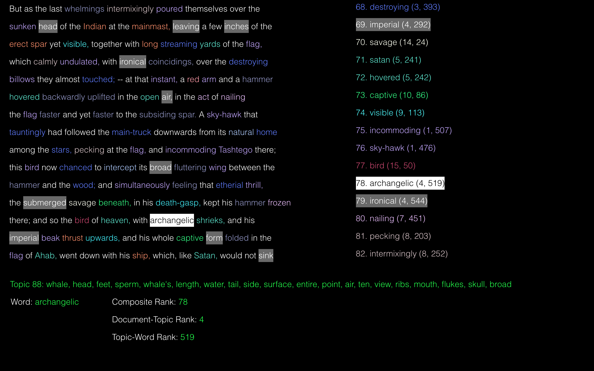

# Topic Words in Context (TWiC) Close Reading

## Table of Contents

* [Overview](#overview)
  * [The Modeled Text](#modeled_text)
  * [Model Data](#model_data)
  * [Topic Words ordered by Composite Rank](#topicwords_orderedby_comprank)  
* [How to Use](#how_to_use)
  * [YAML Configuration File](#yaml_config_file)
  * [Python Script](#python_script)
* [Technical Notes & Known Issues](#known_issues)

## Overview

  **TWiC Close Reading** (TCR) is a Python script that generates interactive HTML files for texts that have been modeled by the [MALLET topic modeler](http://mallet.cs.umass.edu/). It leans on code and ideas from my previous D3 visualization for topic models, ["Topic Words in Context" or "TWiC"](https://github.com/jarmoza/twic), which offers a more comprehensive look at topic models. *TCR* is built to look at the texts themselves under the lens of the topic weights in each text, and topic word weights in their topics. While *TWiC* already provides a similar view in its "Text View" panel, *TCR* is meant to give a more lightweight, more informative and easily browsable version of this view. The idea here is to facilitate making substantive connections between a human-authored text and the underlying statistical data that models it. Below is a sample image so you can get an idea of what such a view looks like on one of the last paragraphs of Herman Melville's *Moby-Dick* (spoiler alert).

  

    

  **The Modeled Text**

  In the view above of a single text considered by the topic model, topics - and thus the words from them - are each given a unique color. On the left is a view of the full text with those colored words. (Really a topic model considers each text as a "bag" of words without order, but here we reinstitute the human-authored ordering for *context*.) Just scroll down to see more of the text. Mousing over each word will highlight it and any other instance of that word in the text in white. This will also result in any other word from that the topic of that word to be highlighted in gray. Corresponding words in the composite rank word list on the right are also highlighted. This portion of the view is [explained below](#topicwords_orderedby_comprank).

    

  **Model Data**

  On the bottom is a view of the output model data with one additional metric. This information is supplied as one mouses over topic words: 

  **1.** Topic word 
  **2.** Top 20 words of that topic (ranked by their topic-word weight) 
  **3.** Document-Topic Rank 
  **4.** Topic-Word Rank 
  **5.** Composite Rank (of both document-topic and topic-word weights for this word in this text)

  As one might expect, listed values include the topic word being highlighted and the top 20 words from that word's topic. Also listed, however, are the rankings of three weights that, given the context of the output topic model, can help viewers understand the place of these words in that model.

  *Document-Topic Rank*

  Since documents of the topic model receive an apportionment or distribution of topics weighted by the modeling process, we are able to rank the most highly weighted/most featured topics of the document. This is one way of perceiving topics in a text.

  *Topic-Word Rank*

  Topics themselves, each of which are composed of all words in the modeled corpus, also receive an apportionment or distribution of word weight. Ranking words in a topic by this weight is yet another way of perceiving how a topic model is represented at the level of a single text.

  *Composite Rank*

  The composite rank takes into account both of these weights and how (when multiplied together into a composite weight) they compare to other composite weights of words in this text. Among the many ways to attempt a close examination of the topic model when juxtaposed like this with a human-authored ordering a text in that model, the *composite rank* is supplied as one suggestion of how to weigh the relevance or likelihood of strong/weak word associations in the model.

    

  **Topic Words ordered by Composite Rank**

  On the right is a list of all of the words in the text ordered by the composite rank explained above. (Multiple instances of words are included and are given the same rank.) These topic words also highlight upon mouseover in the same way they do for the text. Mousing over these words will also highlight corresponding words from this topic in the text. Scrolling down will reveal more of this list. Listed next to each word in parentheses are their document-topic rank and topic-word rank.

## How to Use

  Using TWiC Close Reading (TCR) is a simple, two-step process:

  **1.** Edit the script's YAML configuration file in the root folder, `tcr_config.yaml`. 
  **2.** Run TCR's primary Python script, `twic_close_reading.py`. 

    

  **YAML Configuration File**

  *mallet_files_path*

  The folder where your MALLET topic model files sit. All of the files listed below are required for *TWiC Close Reading* (TCR) to function. TCR supports model files from MALLET version 2.0.8 and higher.

  *mallet_state_file*

  Name of the (unzipped) topic "state" file generated by the MALLET option `--output-state`.

  *mallet_topicweights_file*

  Name of the file generated by the `--output-doc-topics` MALLET option that contains corpus file names and their respective topic weights.

  *mallet_topics_file*

  Name of the file generated by the `--output-topic-keys` MALLET option that contains the numeric topic ID, average corpus weight for each topic, and the familiar list of its top 20 topic words.

  *mallet_wordweights_file*

  Name of the file generated by the `--topic-word-weights-file` MALLET option that contains a list of words, their assigned topic ID, and weight in that topic.

  *corpus_path*

  The folder where the txt files of your corpus modeled by MALLET are stored

  *output_path*

  The folder where you would like TCR to output its HTML files

  *corpus_title*

  A name for your corpus used internally by TCR. Will only be shown in its terminal output. (Please use underscores in lieu of spaces).

    

  **Python Script**

  Once you have filled in all the fields in `tcr_config.yaml`, just run *TWiC Close Reading's* primary Python script: `python twic_close_reading.py`. (Note: This script does rely on a few other Python scripts stored in the `lib` folder, so you do need to leave it in place in the root folder of *TCR*.)

## Technical Notes & Known Issues

  * *TWiC Close Reading* (TCR) is compatible with [MALLET versions 2.0.8](http://mallet.cs.umass.edu/download.php) and higher
  * Please be aware that for some texts, MALLET may not produce state file data. If no state file data is detected for a text, TCR will not produce an HTML file for it since that data is an integral part of its output. (This may be a known or expected issue. I will be inquiring on the [MALLET github project](https://github.com/mimno/Mallet) about it in the near future.)
  * Currently my implementation of scrolling through multiple panels in Twitter bootstrap columns is a little glitchy. More of the text and composite rank list is available by scrolling downward in the respective panel/part of the *TCR* window.
  * *TCR* should be functional across MacOS, Windows, and Linux. Its Python script detects and uses the appropriate folder separator character.
  * Expected text encoding is *UTF-8*